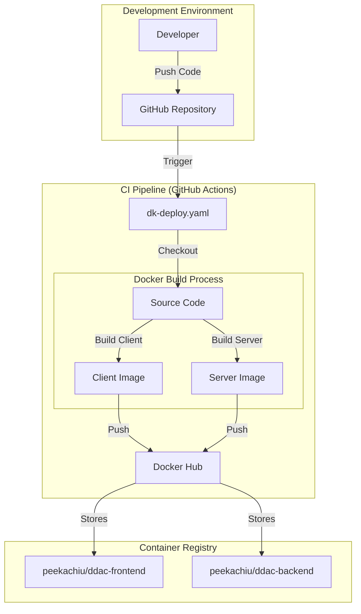

# System Architecture & Workflow

This document outlines the end-to-end workflow of the ResidentPro system, covering the Continuous Integration (CI/CD) pipeline, infrastructure provisioning via Terraform, and the runtime deployment architecture on AWS.

## 🔄 Project Workflow Overview

The project workflow consists of three main phases:
1.  **Build & Publish** (Docker): Containerizing the application and pushing to Docker Hub.
2.  **Infrastructure as Code** (Terraform): Provisioning the AWS environment (Network, Compute, Database).
3.  **Deployment & Runtime** (EC2 + User Data): Instances automatically configuring themselves and pulling the latest application images.

---

## 🏗️ 1. CI/CD & Build Workflow

This phase handles converting source code into deployable Docker artifacts.



### Steps:
1.  **Code Push**: Developers push changes to the `main` branch.
2.  **GitHub Action Trigger**: The `dk-deploy.yaml` workflow is triggered.
3.  **Docker Build**:
    *   **Frontend**: Built from `./client`, using Node.js/Next.js.
    *   **Backend**: Built from `./server`, using .NET 9.0 SDK.
4.  **Push to Registry**: The tagged images (`:Production`) are pushed to Docker Hub, making them available for deployment.

---

## ☁️ 2. Infrastructure & Deployment (Terraform)

This phase involves setting up the AWS environment and deploying the application.

```mermaid
graph TD
    subgraph "Infrastructure Deployment"
        Admin[Administrator] -->|Run| TF[Terraform Apply]
        TF -->|Provision| VPC[AWS VPC]
        TF -->|Provision| RDS[Amazon RDS (MySQL)]
        TF -->|Provision| EC2_Web[EC2: Web Server (Public)]
        TF -->|Provision| EC2_API[EC2: API Server (Private)]
    end

    subgraph "Instance Initialization (User Data)"
        EC2_Web -->|Script Start| UserDataWeb[Web User Data]
        UserDataWeb -->|Install| Docker1[Docker Engine]
        UserDataWeb -->|Pull| PullWeb[Pull Frontend Image]
        PullWeb -.->|From| DockerHub[Docker Hub]
        
        EC2_API -->|Script Start| UserDataAPI[API User Data]
        UserDataAPI -->|Install| AWSCLI[AWS CLI & Docker]
        UserDataAPI -->|Fetch Secrets| SM[AWS Secrets Manager]
        UserDataAPI -->|Pull| PullAPI[Pull Backend Image]
        PullAPI -.->|From| DockerHub
    end

    subgraph "Database Migration"
        DevMachine[Developer Machine / Bastion] -->|Apply SQL| RDS
    end
```

### Detailed Steps:

#### A. Terraform Provisioning
*   **VPC & Networking**: Creates Public and Private subnets, NAT Gateways, and Internet Gateways.
*   **Database (RDS)**: Launches a MySQL RDS instance in a isolated private subnet.
*   **Security**: Sets up Security Groups (Web, API, DB) and IAM Roles to allow EC2 instances to communicate securely.

#### B. EC2 Deployment (User Data scripts)
When Terraform launches the EC2 instances, the **User Data** scripts (`user_data.sh`) automatically execute the following:

**Frontend Instance (Public Subnet):**
1.  Installs **Docker** and **Nginx**.
2.  Pulls the `peekachiu/ddac-frontend:Production` image from Docker Hub.
3.  Runs the container on port 3000.
4.  Configures Nginx as a reverse proxy to route traffic.

**Backend Instance (Private Subnet):**
1.  Installs **Docker** and **AWS CLI**.
2.  Retrieves Database Credentials securely from **AWS Secrets Manager**.
3.  Pulls the `peekachiu/ddac-backend:Production` image from Docker Hub.
4.  Runs the container, injecting the Database Connection string as environment variables.

#### C. Database Migration
*   Currently, the database schema initialization (`residentproDB.sql`) is applied manually or via a Bastion host to the RDS instance.
*   The API connects to this database using the credentials fetched during the startup phase.

---

## 🏛️ 3. Runtime Architecture

How the system operates once deployed.

```mermaid
graph LR
    User[End User] -->|HTTPS| CF[CloudFront CDN]
    CF -->|Requests| WAF[AWS WAF]
    WAF -->|Filtered| ALB[Public ALB]
    
    subgraph "AWS VPC"
        subgraph "Public Subnet"
            ALB -->|Forward| WebASG[Web Server ASG]
            WebASG -->|Reverse Proxy| WebContainer[Next.js Container]
        end
        
        subgraph "Private Subnet"
            WebContainer -->|API Calls (Internal)| InternalALB[Internal API ALB]
            InternalALB -->|Load Balance| APIASG[API Server ASG]
            APIASG -->|Process| APIContainer[.NET API Container]
            
            APIContainer -->|Read/Write| RDS[(RDS MySQL)]
        end
    end
```
