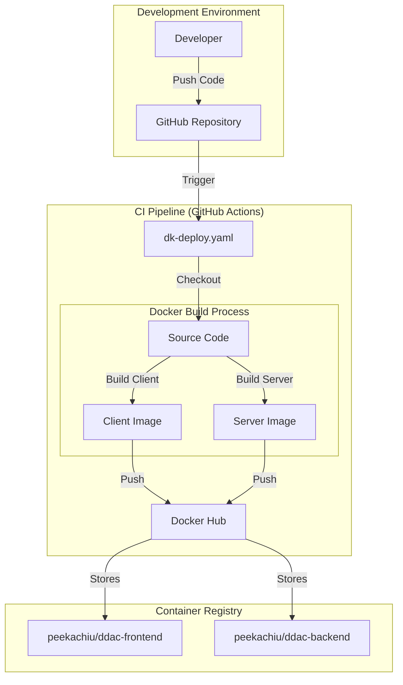
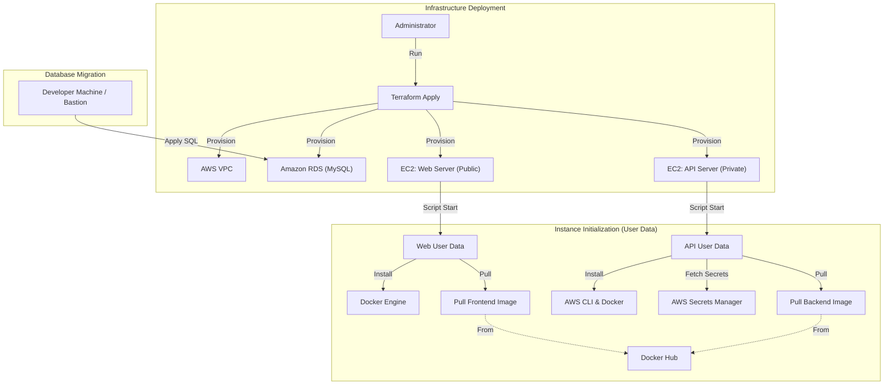

# ResidentPro (DDAC-WebApplication)


## 📖 Project Overview

**ResidentPro** is a modern, cloud-native web application designed to streamline residential management operations. This project demonstrates a comprehensive implementation of a distributed system using a secure 3-tier architecture on Amazon Web Services (AWS).

It separates concerns effectively with a dynamic **Next.js** frontend and a high-performance **ASP.NET Core** backend, all orchestrated via **Terraform** for reliable and reproducible infrastructure deployment.

---

## 🏗️ System Architecture & Workflow

This document outlines the end-to-end workflow of the ResidentPro system, covering the Continuous Integration (CI/CD) pipeline, infrastructure provisioning via Terraform, and the runtime deployment architecture on AWS.

### 🔄 Project Workflow Overview

The project workflow consists of three main phases:
1.  **Build & Publish** (Docker): Containerizing the application and pushing to Docker Hub.
2.  **Infrastructure as Code** (Terraform): Provisioning the AWS environment (Network, Compute, Database).
3.  **Deployment & Runtime** (EC2 + User Data): Instances automatically configuring themselves and pulling the latest application images.

### 1. CI/CD & Build Workflow

This phase handles converting source code into deployable Docker artifacts.



#### Steps:
1.  **Code Push**: Developers push changes to the `main` branch.
2.  **GitHub Action Trigger**: The `dk-deploy.yaml` workflow is triggered.
3.  **Docker Build**:
    *   **Frontend**: Built from `./client`, using Node.js/Next.js.
    *   **Backend**: Built from `./server`, using .NET 9.0 SDK.
4.  **Push to Registry**: The tagged images (`:Production`) are pushed to Docker Hub, making them available for deployment.

### 2. Infrastructure & Deployment (Terraform)

This phase involves setting up the AWS environment and deploying the application.



#### Detailed Steps:

##### A. Terraform Provisioning
*   **VPC & Networking**: Creates Public and Private subnets, NAT Gateways, and Internet Gateways.
*   **Database (RDS)**: Launches a MySQL RDS instance in a isolated private subnet.
*   **Security**: Sets up Security Groups (Web, API, DB) and IAM Roles to allow EC2 instances to communicate securely.

##### B. EC2 Deployment (User Data scripts)
When Terraform launches the EC2 instances, the **User Data** scripts (`user_data.sh`) automatically execute the following:

**Frontend Instance (Public Subnet):**
1.  Installs **Docker** and **Nginx**.
2.  Pulls the `peekachiu/ddac-frontend:Production` image from Docker Hub.
3.  Runs the container on port 3000.
4.  Configures Nginx as a reverse proxy to route traffic.

**Backend Instance (Private Subnet):**
1.  Installs **Docker** and **AWS CLI**.
2.  Retrieves Database Credentials securely from **AWS Secrets Manager**.
3.  Pulls the `peekachiu/ddac-backend:Production` image from Docker Hub.
4.  Runs the container, injecting the Database Connection string as environment variables.

##### C. Database Migration
*   Currently, the database schema initialization (`residentproDB.sql`) is applied manually or via a Bastion host to the RDS instance.
*   The API connects to this database using the credentials fetched during the startup phase.

### 3. Runtime Architecture

How the system operates once deployed.

```mermaid
graph LR
    User[End User] -->|HTTPS| CF[CloudFront CDN]
    CF -->|Requests| WAF[AWS WAF]
    WAF -->|Filtered| ALB[Public ALB]
    
    subgraph "AWS VPC"
        subgraph "Public Subnet"
            ALB -->|Forward| WebASG[Web Server ASG]
            WebASG -->|Reverse Proxy| WebContainer[Next.js Container]
        end
        
        subgraph "Private Subnet"
            WebContainer -->|API Calls (Internal)| InternalALB[Internal API ALB]
            InternalALB -->|Load Balance| APIASG[API Server ASG]
            APIASG -->|Process| APIContainer[.NET API Container]
            
            APIContainer -->|Read/Write| RDS[(RDS MySQL)]
        end
    end
```

---

## 🚀 Technologies Used

### Frontend (`/client`)
-   **Framework**: [Next.js](https://nextjs.org/) (React 19)
-   **Language**: TypeScript
-   **Styling**: Tailwind CSS v4
-   **Components**: Radix UI, Lucide React, Sonner
-   **Motion**: Framer Motion
-   **Utilities**: `axios`, `date-fns`, `jspdf` (Reporting), `@stripe/react-stripe-js` (Payments)

### Backend (`/server`)
-   **Framework**: ASP.NET Core 9.0 Web API
-   **Language**: C#
-   **Database ORM**: Entity Framework Core 8 with Pomelo MySQL
-   **Authentication**: JWT Bearer Authentication
-   **Payments**: Stripe.net SDK
-   **Documentation**: Swagger / Swashbuckle

### Infrastructure & DevOps
-   **Cloud Provider**: AWS (Amazon Web Services)
-   **IaC**: Terraform (v1.0+)
-   **Containerization**: Docker
-   **Networking**: VPC, NAT Gateways, Public/Private Subnets, Route53
-   **Security**: Security Groups, WAF, IAM Roles, Secrets Manager

---

## ✨ Key Features

-   **Secure User Authentication**: Robust login and registration system using JWT.
-   **Responsive Dashboard**: A beautiful, responsive administrative interface built with modern UI components.
-   **Payment Integration**: Seamless payment processing using Stripe.
-   **Automated Reporting**: Generation of PDF reports and invoices directly from the client.
-   **High Availability**: Auto-scaling groups ensure the application handles traffic spikes gracefully.
-   **End-to-End Security**: SSL/TLS encryption via ACM and CloudFront, with strict network isolation.

---

## 🛠️ Getting Started

### Prerequisites
-   [Node.js](https://nodejs.org/) (v18 or later)
-   [.NET 9.0 SDK](https://dotnet.microsoft.com/download/dotnet/9.0)
-   [Terraform CLI](https://www.terraform.io/)
-   [AWS CLI](https://aws.amazon.com/cli/) (Configured with credentials)
-   [Docker](https://www.docker.com/) (Optional, for containerized runs)

### 1. Backend Setup
Navigate to the server directory and start the API:
```bash
cd server
dotnet restore
dotnet run
```
The API will be available at `http://localhost:5000` (or configured port).

### 2. Frontend Setup
Navigate to the client directory and start the development server:
```bash
cd client
npm install
npm run dev
```
Access the application at `http://localhost:3000`.

### 3. Infrastructure Deployment (AWS)
Deploy the full cloud infrastructure using Terraform:

1.  Navigate to the `terraform` directory:
    ```bash
    cd terraform
    ```
2.  Initialize the project:
    ```bash
    terraform init
    ```
3.  Preview the deployment plan:
    ```bash
    terraform plan
    ```
4.  Apply the changes to AWS:
    ```bash
    terraform apply
    ```

---

## 🤝 Contributing

Contributions are welcome! Please follow these steps:
1.  Fork the repository.
2.  Create a feature branch (`git checkout -b feature/AmazingFeature`).
3.  Commit your changes (`git commit -m 'Add some AmazingFeature'`).
4.  Push to the branch (`git push origin feature/AmazingFeature`).
5.  Open a Pull Request.

---

## 📝 License

Distributed under the MIT License. See `LICENSE` for more information.
